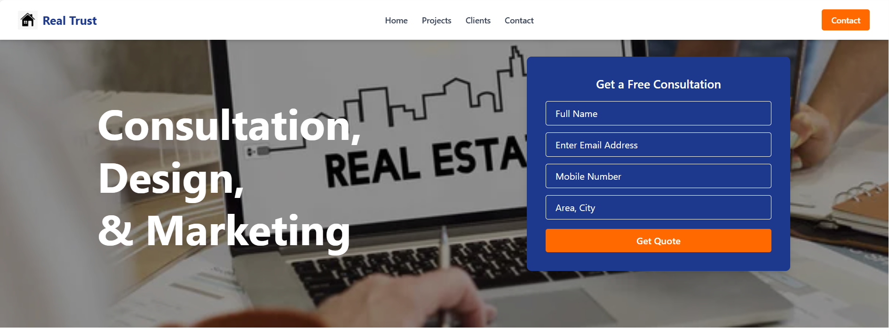

<<<<<<< HEAD
# Client & Project Management Full Stack App

This is a full-stack web application consisting of a **Landing Page** and an **Admin Panel** to manage projects, clients, contact form submissions, and newsletter subscriptions. Built as a task for a placement assignment, this app demonstrates frontend-backend integration, admin control functionality, and user interactivity.

## 🧩 Features

### 🌐 Landing Page
- **Our Projects Section**: Lists all projects with image, name, and description (fetched from backend)
- **Happy Clients Section**: Displays client testimonials with image, name, description, and designation
- **Contact Form**: Users can submit contact information (stored in backend and shown in admin panel)
- **Newsletter Subscription**: Users can subscribe with their email (data saved to backend)

### 🛠️ Admin Panel
- **Project Management**: Add new projects (name, description, image)
- **Client Management**: Add client testimonials (name, image, description, designation)
- **Contact Form Entries**: View all user-submitted contact forms
- **Newsletter Subscriptions**: View all subscribed email addresses

---

## 📦 Tech Stack

### Frontend
- React.js  
- Tailwind CSS / Bootstrap  
- Axios

### Backend
- Node.js  
- Express.js  
- MongoDB (MongoDB Atlas)

---

## 📸 Screenshots

=======
# Client & Project Management Full Stack App

This is a full-stack web application consisting of a **Landing Page** and an **Admin Panel** to manage projects, clients, contact form submissions, and newsletter subscriptions. Built as a task for a placement assignment, this app demonstrates frontend-backend integration, admin control functionality, and user interactivity.

## 🧩 Features

### 🌐 Landing Page
- **Our Projects Section**: Lists all projects with image, name, and description (fetched from backend)
- **Happy Clients Section**: Displays client testimonials with image, name, description, and designation
- **Contact Form**: Users can submit contact information (stored in backend and shown in admin panel)
- **Newsletter Subscription**: Users can subscribe with their email (data saved to backend)

### 🛠️ Admin Panel
- **Project Management**: Add new projects (name, description, image)
- **Client Management**: Add client testimonials (name, image, description, designation)
- **Contact Form Entries**: View all user-submitted contact forms
- **Newsletter Subscriptions**: View all subscribed email addresses

---

## 📦 Tech Stack

### Frontend
- React.js  
- Tailwind CSS / Bootstrap  
- Axios

### Backend
- Node.js  
- Express.js  
- MongoDB (MongoDB Atlas)

---

## 📸 Screenshots

>>>>>>> 35f97d5 (second commit)
